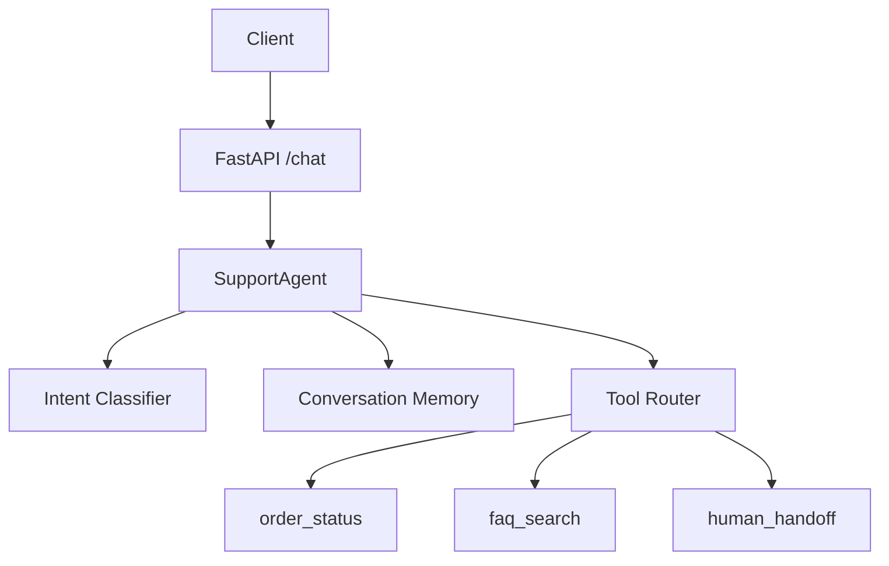

# AI Agent Demo

[](https://github.com/kauadev77/ai-agent-demo/actions/workflows/ci.yml)


[](LICENSE)

A portfolio-safe **AI agent backend** built with Python and FastAPI to demonstrate agent orchestration, intent classification, tool routing, short-term conversation memory, API validation, automated tests and containerization.

The implementation is intentionally deterministic and provider-agnostic, so the orchestration layer can later be connected to an LLM without changing the public API contract.

## What this demonstrates

- FastAPI REST API design
- Agent/service separation
- Intent classification and tool selection
- Conversation-scoped memory
- Pydantic request/response validation
- Health endpoint
- Automated testing with pytest
- Docker packaging
- CI with GitHub Actions
- Safe portfolio design with fictional data only

## Architecture



## Project structure

```text
.
├── app/
│   ├── agent.py
│   ├── main.py
│   └── models.py
├── tests/
│   └── test_agent.py
├── .github/workflows/ci.yml
├── .env.example
├── Dockerfile
├── requirements.txt
└── README.md
```

## Run locally

```bash
python -m venv .venv
source .venv/bin/activate  # Windows: .venv\Scripts\activate
pip install -r requirements.txt
uvicorn app.main:app --reload
```

Open the interactive API docs at `http://localhost:8000/docs`.

## Example request

```bash
curl -X POST http://localhost:8000/chat \
  -H "Content-Type: application/json" \
  -d '{"conversation_id":"demo-1","message":"Where is order 123?"}'
```

Example response:

```json
{
  "conversation_id": "demo-1",
  "intent": "order_status",
  "tool": "order_status",
  "response": "Order 123 is in transit. This is fictional demo data."
}
```

## Tests

```bash
pytest
```

## Docker

```bash
docker build -t ai-agent-demo .
docker run --rm -p 8000:8000 ai-agent-demo
```

## Environment

Copy `.env.example` to `.env` when experimenting with external LLM providers. The current implementation does not require an API key.

## Roadmap

- Connect an LLM provider through the agent interface
- Persist memory in PostgreSQL
- Add retrieval over a vector store
- Add authentication and rate limiting
- Add structured observability

## Portfolio safety

This project was built from scratch for public demonstration. It does not contain company code, customer data, internal prompts or private integrations.

## License

MIT
